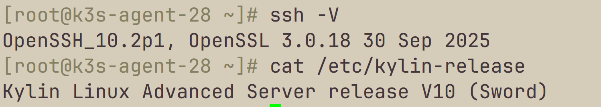
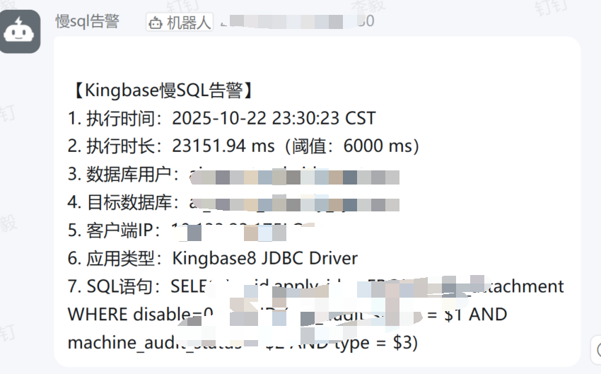

# 信创环境实战解决方案

本仓库专为信创（信息技术应用创新）环境下的企业级运维、安全加固及性能优化提供实战方案。

## 核心展示
1. **麒麟V10 (Kylin) 安全加固**
   - 漏洞修复：OpenSSH 10.2p1 + OpenSSL 3.0.18 完美适配。

2. **人大金仓 (Kingbase) 运维监控**
   - 慢 SQL 实时监控。

---
**注：本仓库仅展示成果截图与核心思路，如需完整技术支持或方案定制，请联系开发者。QQ 1003770043**
